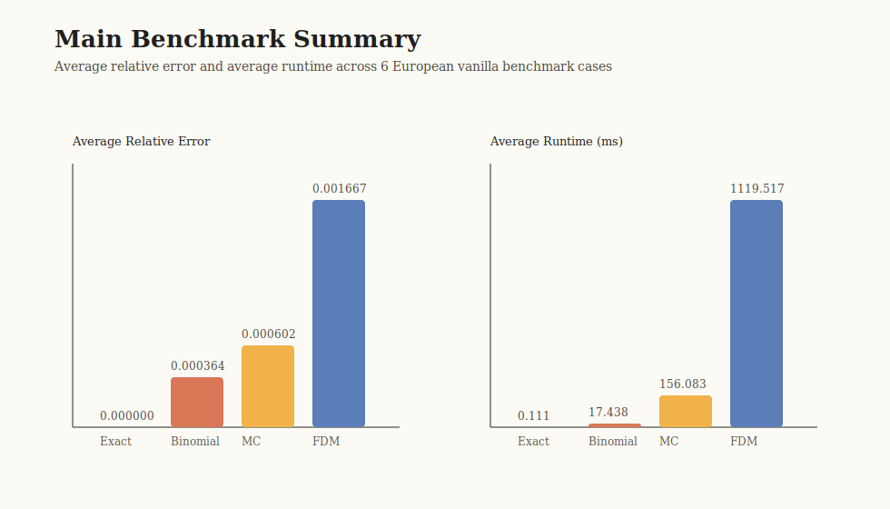

# C++ Option Pricing Benchmark Framework

A C++ benchmark framework for **European vanilla option pricing** that compares four pricing paradigms on a shared case pack:

- **Exact** Black-Scholes closed form
- **Binomial** CRR lattice
- **Monte Carlo** with crude, antithetic, and control-variate variants
- **Finite Difference** via an explicit Euler PDE solver

The project reuses the underlying numerical cores, but wraps them in a cleaner experiment system with shared inputs, structured CSV outputs, lightweight validation, and GitHub-ready result assets.



## Why This Project Is Stronger Than A Simple Pricing Demo

- It benchmarks **multiple numerical methods on the same option family**, not isolated toy examples.
- It adds **variance reduction and uncertainty reporting** to the Monte Carlo line.
- It produces **reproducible experiment outputs, validation summaries, tables, and figures**.
- It stays focused on one technically coherent problem domain instead of expanding into unrelated models.

## Current Scope

The framework stays within one clean product scope:

- **European vanilla call/put options**
- Black-Scholes-style market inputs
- exact pricing, lattice pricing, Monte Carlo pricing, and PDE pricing
- benchmark, variance-reduction, and validation workflows

American pricing, CIR, and Excel demo material are preserved as side paths, but they are not part of the benchmark headline.

## Repository Highlights

- Core benchmark app: [code/Projects/OptionPricingBench/](code/Projects/OptionPricingBench/)
- Shared benchmark layer: [code/ResumeCore/](code/ResumeCore/)
- Archived standalone reference solutions: [code/archive_projects/](code/archive_projects/)
- Result figures: [results/figures/](results/figures/)
- Summary tables: [results/tables/](results/tables/)
- Build notes: [BUILD.md](BUILD.md)
- Source map: [PROJECT_MAP.md](PROJECT_MAP.md)
- Experiment interpretation: [RESULTS_SUMMARY.md](RESULTS_SUMMARY.md)

## Supported Workflows

The benchmark executable now supports lightweight run modes:

- `benchmark`: main benchmark + binomial convergence + FDM grid study
- `mc_variance`: Monte Carlo variant comparison study
- `validation`: validation harness only
- `all`: run everything and refresh all raw outputs

The entrypoint is [code/ResumeCore/App/main.cpp](code/ResumeCore/App/main.cpp).

## Key V2 Features

### Monte Carlo V2

- crude Monte Carlo
- antithetic variates
- control variate Monte Carlo anchored to the exact Black-Scholes price
- standard error and 95% confidence interval reporting
- dedicated variance-reduction study output in `mc_variance_study.csv`

### Validation Layer

- exact-price regression anchors
- exact put-call parity sanity check
- tolerance-based checks for approximate methods
- benchmark output sanity checks
- MC variance-reduction sanity checks

### Packaged Outputs

Raw outputs are written under [code/Projects/OptionPricingBench/output/](code/Projects/OptionPricingBench/output/):

- `benchmark_results.csv`
- `binomial_convergence.csv`
- `fdm_grid_study.csv`
- `mc_variance_study.csv`
- `validation_summary.csv`
- `validation_summary.md`

Packaged outputs are generated into:

- [results/figures/benchmark_tradeoff.svg](results/figures/benchmark_tradeoff.svg)
- [results/figures/binomial_convergence.svg](results/figures/binomial_convergence.svg)
- [results/figures/mc_variance_comparison.svg](results/figures/mc_variance_comparison.svg)
- [results/figures/fdm_grid_tradeoff.svg](results/figures/fdm_grid_tradeoff.svg)
- [results/tables/benchmark_method_summary.csv](results/tables/benchmark_method_summary.csv)
- [results/tables/mc_variant_summary.csv](results/tables/mc_variant_summary.csv)
- [results/tables/validation_overview.csv](results/tables/validation_overview.csv)

## Current Experimental Takeaways

These highlights come from the latest **Release** outputs:

- **Binomial** is still the best overall accuracy/runtime trade-off in the main benchmark, averaging about **17.44 ms** runtime with **0.003377** average absolute error.
- **MC V2** is much stronger than the earlier prototype. With the current control-variate baseline, MC averages about **0.005907** absolute error with **0.002146** average standard error.
- **Control variate MC** is the clear winner among MC variants in the dedicated variance study:
  - crude avg abs error: **0.091678**
  - antithetic avg abs error: **0.062828**
  - control variate avg abs error: **0.002914**
- The validation harness currently passes **9 / 9** checks.

The fuller breakdown is in [RESULTS_SUMMARY.md](RESULTS_SUMMARY.md).

## Build And Run

1. Open [OptionPricingBench.sln](code/Projects/OptionPricingBench/OptionPricingBench.sln) in Visual Studio 2022.
2. Choose `Release | Win32`.
3. Run `OptionPricingBench` with `all` to refresh all raw outputs.
4. Regenerate packaged assets:

```powershell
powershell -ExecutionPolicy Bypass -File .\scripts\generate_results_assets.ps1
```

Detailed environment and dependency notes are in [BUILD.md](BUILD.md).

## Useful Source Entry Points

- [ResumeCore/Common/MethodConfig.hpp](code/ResumeCore/Common/MethodConfig.hpp)
- [ResumeCore/Adapters/MCPricer.cpp](code/ResumeCore/Adapters/MCPricer.cpp)
- [ResumeCore/Experiments/ExperimentPack.cpp](code/ResumeCore/Experiments/ExperimentPack.cpp)
- [ResumeCore/Experiments/ExperimentRunner.cpp](code/ResumeCore/Experiments/ExperimentRunner.cpp)
- [ResumeCore/Validation/ValidationHarness.cpp](code/ResumeCore/Validation/ValidationHarness.cpp)

## Presentation Value

This project is well-suited for GitHub, resume, and interviews because it shows:

- a unified pricing framework rather than isolated single-purpose entrypoints
- practical variance-reduction techniques and uncertainty reporting
- lightweight but meaningful validation discipline
- clear experimental trade-offs between analytical, lattice, simulation, and PDE methods
